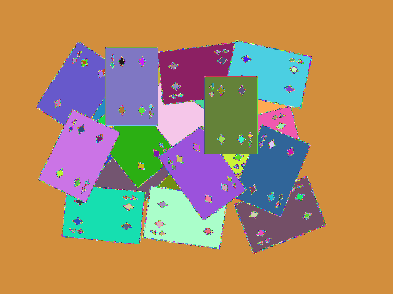

# seed_fill_segmentation
A Simple and Efficient Algorithm for Connected Component Labeling in Color Images

This code is C++/OpenCV implementation of Connected Component Labeling algorithm from paper by M. Emre Celebi,
"A Simple and Efficient Algorithm for Connected Component Labeling in Color Images" 
[https://ui.adsabs.harvard.edu/abs/2012SPIE.8295E..1HC/abstract](https://ui.adsabs.harvard.edu/abs/2012SPIE.8295E..1HC/abstract).

I was interested in how the algorithm is sensitive to half-tone noise in input images.

As a color difference metric I selected simple euclidian norm of RGB difference.

My conclusion is that the algorithm indeed performs very fast, but is too highly sensitive to half-tone noise.

